Linkliar is one of the intentionally vulnerable iOS applications provided by the **[Mobile Hacking Lab](https://www.mobilehackinglab.com/)** platform for practicing **mobile application security and exploitation techniques**. The app scans URLs to detect any malicious content and processes HTTP headers in a way that is unsafe, making it susceptible to **memory corruption and buffer overflow attacks**. By carefully analyzing its header parsing routines and leveraging Objective-C runtime behaviors, we were able to identify a vulnerability that allows overriding execution flow to trigger the app’s **flag function** and extract the challenge flag.

Learning Outcomes of the challange: 

1 - **Buffer Overflow Exploitation**: Gain a deep understanding of buffer overflow vulnerabilities in iOS apps and how to exploit them.

2 - **Advanced ARM Reverse Engineering**: Enhance your skills in reverse engineering, focusing on identifying and exploiting memory corruption issues.

## Application Behavior Analysis

During the initial analysis of the application's behavior, different URLs were tested to observe how the application processes HTTP responses.

When entering the URL `https://example.com`, the application responded normally. The user interface displayed logs indicating that the URL was safe, and the HTTP response returned a status code 200, confirming that the request was successfully processed.

However, when entering another URL such as `https://google.com`, the application crashed and terminated immediately. This unexpected behavior suggested that the application might be encountering an error while processing certain HTTP responses.

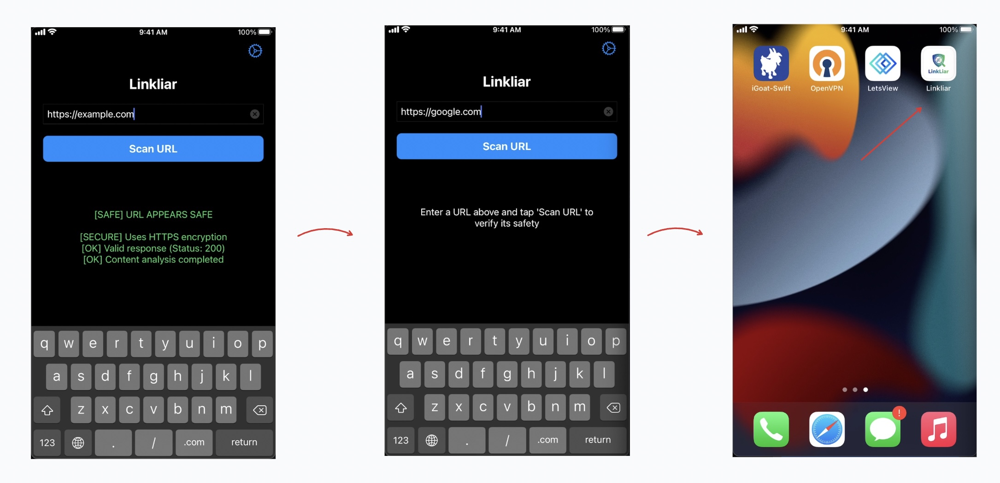
*Application Crashed and Terminated Immediately*

The difference in behavior between these two URLs indicated that the crash was likely related to how the application handles specific HTTP headers or response data, which **motivated further runtime analysis and debugging** to identify the root cause of the issue.

## Runtime Analysis and Application Debugging

To better understand the cause of the application crash observed during the behavioral analysis phase, we performed runtime analysis by attaching a debugger to the application running on a jailbroken physical iPhone.

First, we connected to the device using SSH and started a debugging server with the following command:

```shell
debugserver-16 0.0.0.0:1234 --attach=Linkliar
```

This command attaches the debugger to the running Linkliar process and opens a debugging port that allows a remote debugger to connect.

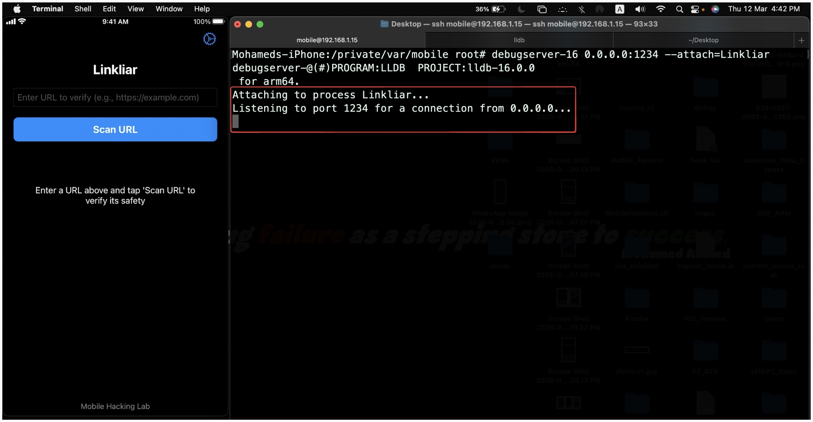
*Start Debugging Server and Attach to The Application Process*

Next, from the host macOS machine, we launched LLDB and connected to the remote debugging session using the following command:

```shell
process connect connect://192.168.1.15:1234
```

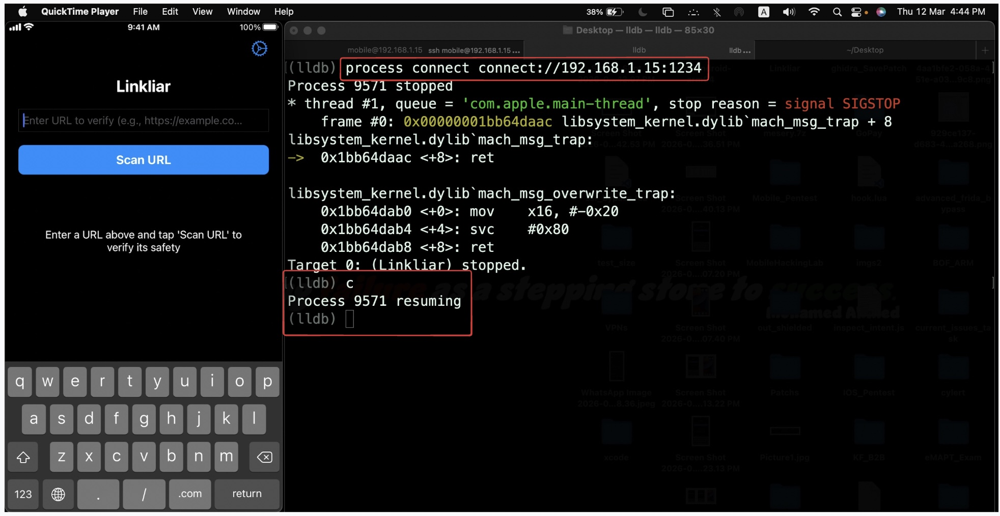
*Connecting to the Debugging Server*

After successfully connecting to the debugging server, we issued the `c` (continue) command to resume the execution of the application. At this stage, the application may briefly pause while the debugger loads and resolves debugging symbols, which is a normal internal operation of the debugging process.

Once the debugger was attached, we entered the URL `https://google.com` into the application and pressed the Scan URL button. Immediately afterward, the process stopped in the debugger and an exception was raised:

```shell
Process 9571 stopped
* thread #1, queue = 'com.apple.main-thread', stop reason = EXC_BAD_ACCESS
(code=257, address=0x100796c6e)
```

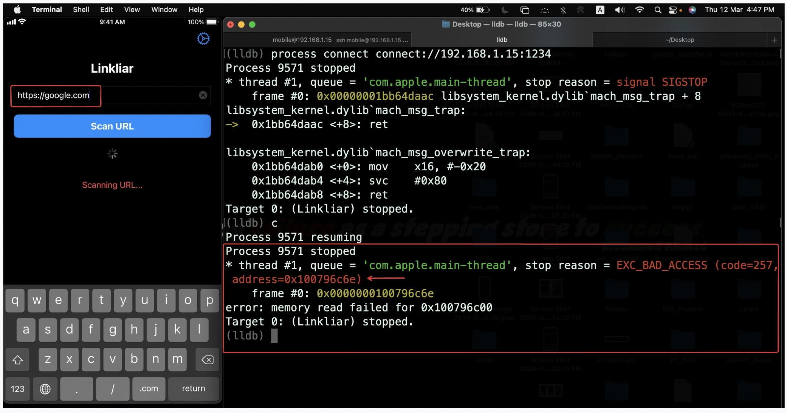
*Runtime Memory Error*

The `EXC_BAD_ACCESS` exception indicates that the application attempted to access an invalid memory location. This type of error is commonly associated with **memory corruption issues** such as buffer overflows.

To further analyze the crash, we used the `bt` command in `LLDB`. This command is used to display the **call stack (backtrace)** of the current thread at the point where the program stopped.

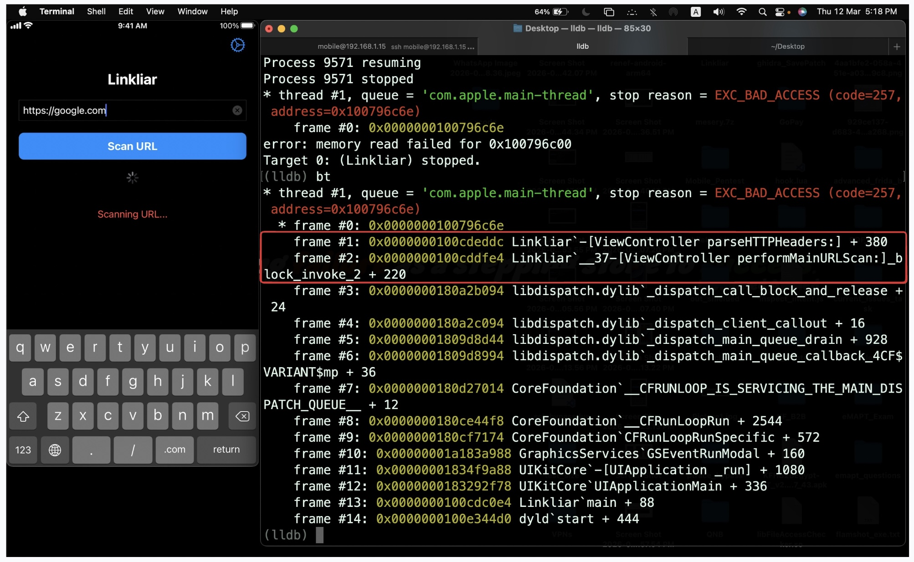
*Showing Call Stack (backtrace) of the current Thread*

The stack trace clearly shows that the crash occurred during the execution of the parseHTTPHeaders function inside the ViewController class.

This observation indicates that the crash is likely related to the way the application processes HTTP response headers. Therefore, this finding guided the next step of the analysis, which involved performing static analysis and reverse engineering of the parseHTTPHeaders function to understand how the headers are handled internally and to identify the root cause of the vulnerability.

## Reverse Engineering and Static Anslysis

To understand the root cause of the crash observed during runtime debugging, we performed static analysis of the application binary using [Ghidra](https://github.com/nationalsecurityagency/ghidra).

First, we extracted the IPA file and loaded the main Mach-O binary into Ghidra for analysis, After the automated analysis completed, we navigated to the `Symbol Tree panel` and searched for the function name `parseHTTPHeaders`, which had already been identified during the debugging phase from the LLDB stack trace.

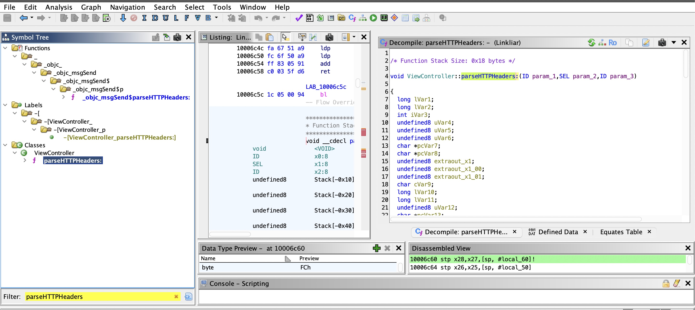
*Find The Function in Ghidra*

Opening this function in the Ghidra Decompiler allowed us to inspect the reconstructed C-style code. By analyzing the decompiled code, we observed that the application processes HTTP headers and stores them inside a `local stack buffer`. The header names are copied `character-by-character` into a `fixed-size buffer` defined in the stack frame.

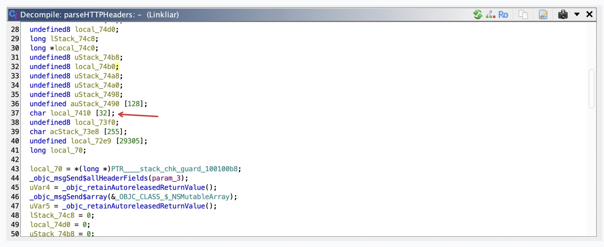
*Analyze ParseHTTPHeader Function*

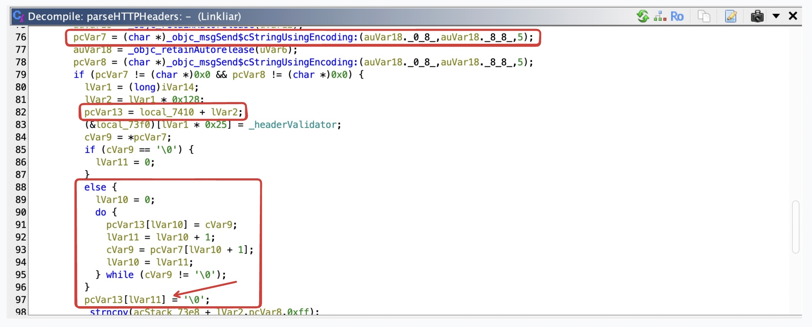
*Analyze ParseHTTPHeader Function*

In the snippet of code:

 - `pcVar7` points to the source string, which contains the HTTP header name.
 - `pcVar13` points to the destination buffer located on the stack (local_7410).
 - The loop copies one character at a time from the source string into the stack buffer until it encounters a null terminator.

To further validate that **memory corruption** was occurring at runtime, we returned to the debugger and inspected the processor registers using the following command: 

```shell
(lldb) register read
```

This command prints the current values of the ARM64 general-purpose registers at the moment the crash occurred.

Example output:

```shell
pc = 0x0000000100796c6e
lr = 0x0000000100cdeddc  Linkliar`-[ViewController parseHTTPHeaders:] + 380
sp = 0x000000016f11f140
```

The most important registers in this context are:

 - PC (Program Counter) – points to the instruction currently being executed.
 - LR (Link Register) – stores the return address of the current function.
 - SP (Stack Pointer) – points to the current location of the stack.

The crash occurred at the address stored in the program counter (PC): `pc = 0x0000000100796c6e`

When the debugger attempted to read memory at this location, it failed, This behavior suggests that the program attempted to execute an invalid or corrupted address, which is a common symptom of a buffer overflow where stack memory has been overwritten.

Another indication of **memory corruption** can be seen in some registers containing what appears to be ASCII-like data rather than valid memory addresses.

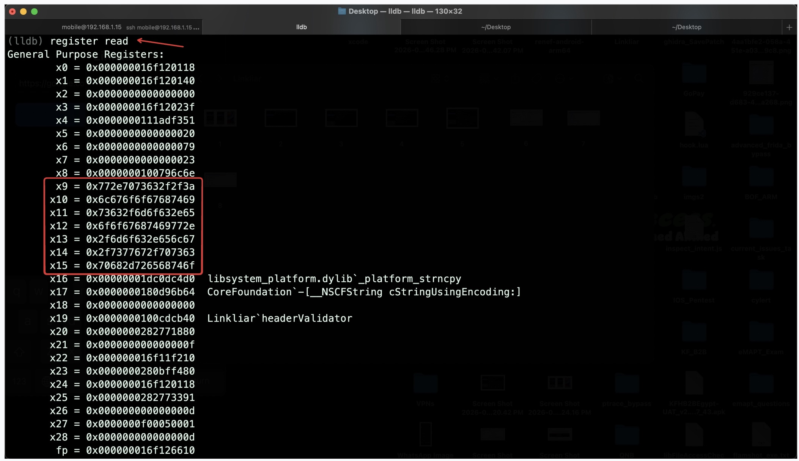
*Read CPU Registers*

All of these observations confirm that the crash is caused by **memory corruption** during HTTP header processing. This finding leads directly to the next stage of the analysis, where we focus on identifying the exact vulnerable code responsible for the overflow.

## Triggering the Buffer Overflow Vulnerability

Before triggering the vulnerability, we need to understand **how function calls are handled in memory** and how a buffer overflow can affect program execution.

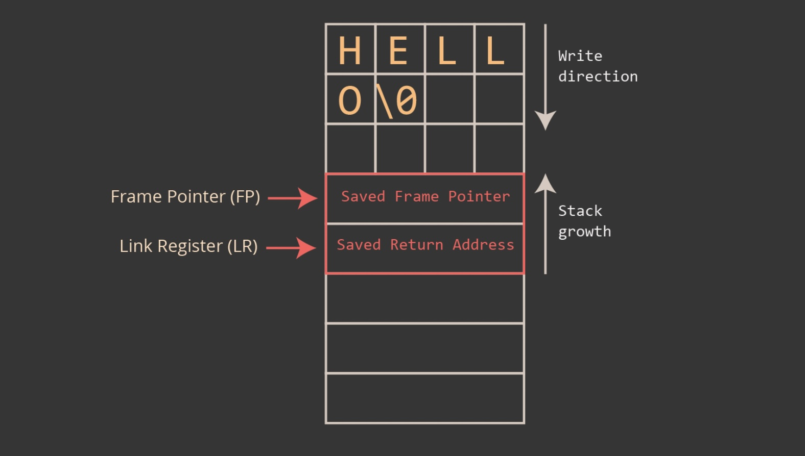
*Normal Stack Layout*

In the last figure, we can observe a **simplified representation of the stack frame** during the execution of a function. When a function is called, the system stores important control information on the stack. This includes:

 - The **saved frame pointer** (FP), which helps maintain the current stack frame structure.
 - The **saved return address**, which is taken from the **Link Register (LR)**. This address indicates 
where the **program should return once the function finishes execution**.

At the top of the stack frame, the function also stores local variables, such as buffers used to temporarily hold data. In this challenge, the HTTP header name is copied into such a buffer.

When the header size is small (for example `HELLO`), the data fits entirely inside the allocated buffer and does not overwrite any other stack values. As a result, the saved frame pointer and the saved return address remain intact, allowing the program to return safely to the caller.

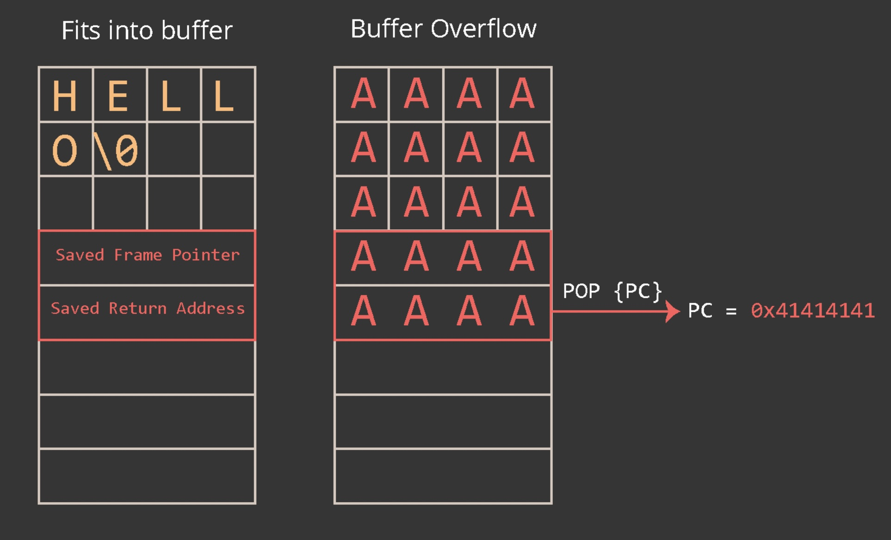
*Buffer Overflow Scenario*

If an attacker sends a header name longer than the buffer can hold (for example a sequence of `A` characters), the copying operation continues writing past the end of the buffer. Because the program does not perform proper bounds checking, the extra data overwrites adjacent stack memory.

As the overflow progresses, the attacker-controlled data overwrites:

 - **The saved frame pointer**
 - **The saved return address**

When the function finishes execution, it attempts to restore the return address and transfer control back to the caller. However, because the return address has been overwritten with attacker-controlled data (`0x41414141`, which corresponds to the ASCII character `A`), the processor loads this corrupted value into the **Program Counter (PC)**.

To reproduce the vulnerability in a controlled environment, we implemented a custom Python HTTP server that returns crafted HTTP headers. This allowed us to **precisely control the header name and value lengths** and observe how the application processes them. By gradually increasing the header name size, we were able to trigger the overflow condition and determine the exact offset required to overwrite the return address.

We wrote the following Python script to create a simple HTTP server that sends a deliberately oversized header name.

```python
from http.server import BaseHTTPRequestHandler, HTTPServer

class CustomHandler(BaseHTTPRequestHandler):

    def do_GET(self):
        self.send_response(200)

        self.send_header("AAAAAAAAAAAAAAAAAAAAAAAAAAAAAAAAAAAAAAAA", "TESTING")

        self.end_headers()

        self.wfile.write(b"Hello from custom HTTP server")

server = HTTPServer(("0.0.0.0", 8000), CustomHandler)
print("Server running on http://0.0.0.0:8000")

server.serve_forever()
```

